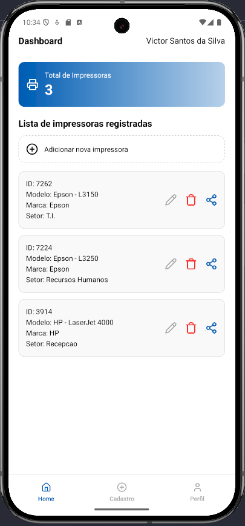

# 🖨️ listagemPrinter

Aplicativo mobile desenvolvido com React Native para auxiliar o setor de T.I. no controle e organização de impressoras de uma empresa.

## 📋 Objetivo

O **listagemPrinter** tem como propósito facilitar a gestão de impressoras dentro de uma organização. A ideia é registrar impressoras por modelo, marca e setor, centralizando informações úteis de forma prática.  
Este projeto é a base para funcionalidades futuras como controle de manutenção e reposição de tinta ou toner.

## 🚀 Tecnologias utilizadas

- [React Native](https://reactnative.dev/)
- [Expo](https://expo.dev/)
- [React Navigation](https://reactnavigation.org/)
- [TypeScript](https://www.typescriptlang.org/)
- (Em breve) [Firebase](https://firebase.google.com/)

## ⚙️ Funcionalidades

- 📌 Cadastro e edição de impressoras
- 📄 Listagem das impressoras registradas
- 🏷️ Cadastro de setores e modelos/marcas de impressoras
- ✏️ Edição e exclusão de registros
- 👤 Tela de login e registro de usuários
- 📊 Dashboard com total de impressoras

## 📱 Execução do projeto

> ⚠️ O projeto está sendo executado via **Device Manager do Android Studio**, mas também pode ser rodado em dispositivos físicos usando o Expo Go.

### Pré-requisitos

- Node.js instalado
- Yarn ou npm
- Android Studio (para emulador)
- Expo CLI

### 📷 Captura de Tela



### Passos

1. Clone o repositório:

```bash
git clone https://github.com/victors21dev/listagemPrinter.git
cd listagemPrinter
```
